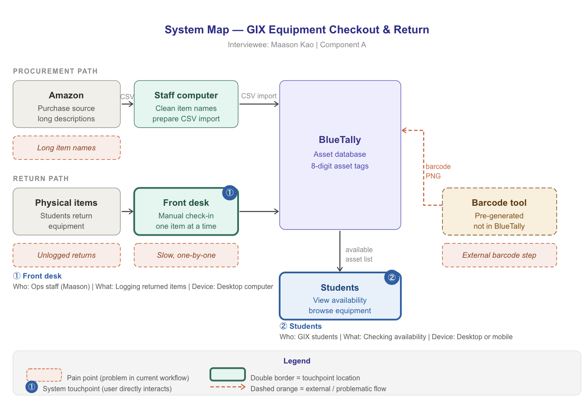
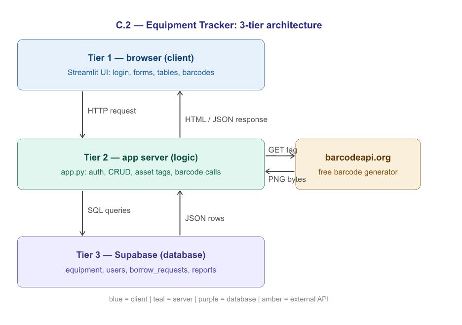
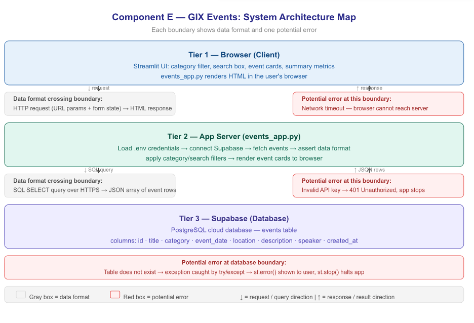
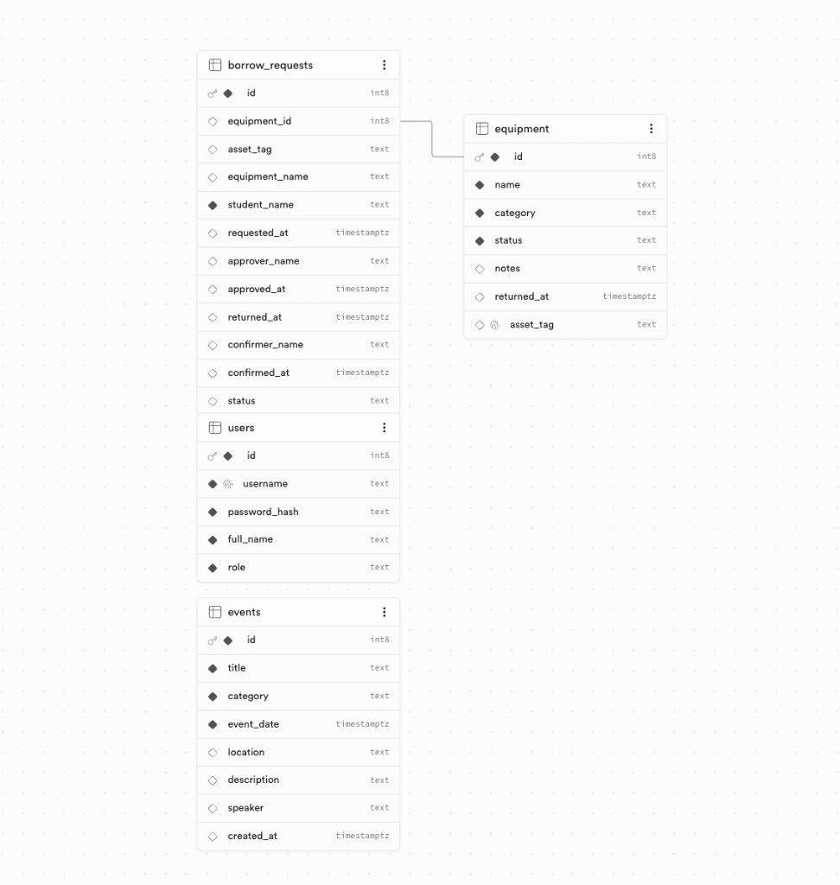

# Lab 5 — GIX Equipment Tracker

**Student:** Peerayad
**Live App:** https://510-lab5-peerayad.streamlit.app/
**Events App:** https://lab-5-peerayad-event.streamlit.app/
**GitHub (Classroom):** https://github.com/GIX-Luyao/lab-5-peerayad

---

## How to access the app

Go to: **https://510-lab5-peerayad.streamlit.app/**

### Demo accounts

| Username | Password | Role |
|---|---|---|
| maason | maason123 | Approver (staff) |
| kevin | kevin123 | Approver (staff) |
| student1 | student123 | Requester (student) |
| student2 | student456 | Requester (student) |

---

## App Features

### Equipment Tracker (app.py)

| Tab | Who | What |
|---|---|---|
| Browse | Both | View inventory, filter, search, export CSV |
| Approve Requests | Approver | Batch approve or reject borrow requests |
| Confirm Returns | Approver | Batch confirm returns, view condition reports |
| All Requests | Approver | Full request history with status filter |
| Add Item | Approver | Add item — auto-generates 8-digit asset tag + barcode |
| Upload CSV | Approver | Bulk import equipment with auto name shortening |
| My Borrow Requests | Requester | Submit requests, view own history |
| Return Equipment | Requester | Mark items returned, fill condition report |

### GIX Events App (events_app.py)

Browse upcoming GIX events with category filter and search.
Live at: **https://lab-5-peerayad-event.streamlit.app/**

---

## Diagrams


### Component A — System map (Maason interview)

<p>
  
</p>

### Component C.2 — 3-tier architecture

<p>
  
</p>

### Component E — Events app architecture

<p>
  
</p>

---

## Schema

### Database schema (Supabase)

<p>
  
</p>

*Relationship:* `borrow_requests.equipment_id` → `equipment.id`

See `schema.sql` for the full SQL and any additional tables.

**Tables:**
- `equipment` — inventory with 8-digit asset tags
- `borrow_requests` — full borrow/return lifecycle
- `users` — login accounts with roles (requester / approver)
- `equipment_checklist` — accessories included with each item
- `return_report` — condition reports submitted by students
- `events` — GIX events for Component E

---

## Security

- No API keys or secrets hardcoded in any source file
- `.env` is in `.gitignore` — never committed to GitHub
- Secrets stored in Streamlit Cloud Advanced Settings → Secrets
- Passwords stored as bcrypt hashes — never plain text

---

## How to run locally

```bash
git clone https://github.com/GIX-Luyao/lab-5-peerayad.git
cd lab-5-peerayad
python -m venv venv
source venv/bin/activate
pip install -r requirements.txt
```

Create a `.env` file:

```
SUPABASE_URL=https://fvfflrzixxastmdhfwqz.supabase.co
SUPABASE_KEY=your_anon_key_here
```

Run Equipment Tracker:

```bash
streamlit run app.py
```

Run Events App:

```bash
streamlit run events_app.py
```